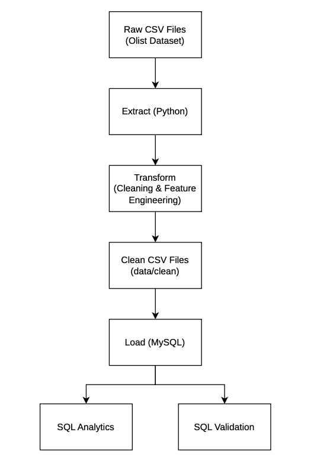
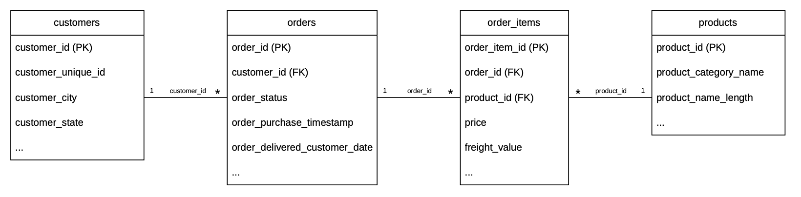
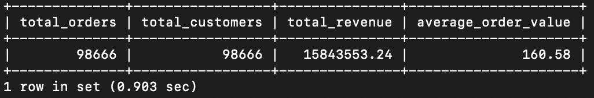
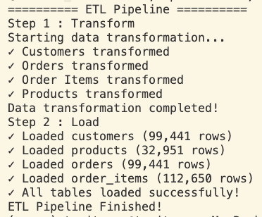

# E-commerce ETL Pipeline


## Overview

An end-to-end data engineering project built with Python, SQL, MySQL, Docker, and Apache Airflow using the Brazilian E-Commerce Public Dataset by Olist.

The project implements an ETL pipeline that extracts raw e-commerce data, transforms and cleans the datasets, and loads analytics-ready data into a MySQL relational database.

Apache Airflow is used to orchestrate the ETL workflow, while Docker Compose provides a reproducible environment for the ETL application, Airflow services, and databases.

This project simulates a real-world data engineering workflow, from raw transactional data to business-ready analytics.

---

## Objectives

* Build a production-style ETL pipeline.
* Transform raw e-commerce data into analytics-ready datasets.
* Load transformed data into MySQL.
* Orchestrate ETL workflows using Apache Airflow.
* Containerize the application and data infrastructure using Docker.
* Answer business questions using SQL analytics.
* Implement data validation checks to improve data quality.

---

## Dataset

This project uses the Brazilian E-commerce Public Dataset by Olist.

**Source:**
https://www.kaggle.com/datasets/olistbr/brazilian-ecommerce

**Dataset size**

- Customers: 99,441
- Orders: 99,441
- Order Items: 112,650
- Products: 32,951

**Tables used:**

- Customers
- Orders
- Order Items
- Products

**Raw files are stored in:**

```text
data/raw/
```

**Transformed datasets are stored in:**

```text
data/clean/
```
---

## Technology Stack

### Programming & Data
* Python 3.11
* Pandas
* SQLAlchemy
* PyMySQL
* SQL

### Database
* MySQL 8.0
* PostgreSQL 16 for Airflow metadata

### Orchestration & Infrastructure
* Apache Airflow 3.0.2
* Docker
* Docker Compose

### Development & Version Control
* Git
* GitHub
* Visual Studio Code

---

## Skills demonstrated

- ETL Pipeline Development
- Data Extraction
- Data Cleaning
- Data Transformation
- Feature Engineering
- Relational Database Design
- SQL Analytics
- Data Validation
- Workflow Orchestration
- Docker Containerization
- Apache Airflow
- Git & GitHub

---

## Architecture

<p align="left">
   </p>

---

## ETL Workflow

The ETL workflow consists of three main stages:

```text
Raw CSV Files
      │
      ▼
Extract (Python)
      │
      ▼
Transform
- Remove duplicates
- Handle missing values
- Standardize data types
- Feature engineering
   • Revenue
   • Delivery days
      │
      ▼
Load (MySQL)
      │
      ▼
SQL Analytics
```

---

## Airflow Orchestration

Apache Airflow is used to orchestrate and schedule the ETL workflow.
The Airflow environment consists of:

```
Airflow API
      Scheduler
      DAG Processor
      PostgreSQL Metadata Database
```

The ETL DAG is located at:

```
airflow/dags/ecommerce_etl_dag.py
```

The DAG coordinates the ETL process and provides workflow monitoring through the Airflow UI.

---

## Docker Environment

Docker Compose is used to run the project services consistently across environments.
Main services include:

```
airflow-api
airflow-scheduler
airflow-dag-processor
airflow-postgres
mysql
app
```

The MySQL container stores the transformed e-commerce data, while PostgreSQL stores Airflow metadata.

---

## Database Schema

The ETL pipeline loads transformed data into a MySQL relational database.



---

## Business Questions

The following analytical queries were designed to answer business questions for different stakeholders.

### 1. CEO — Business Overview

**Business Question**

- What is the overall business performance?

**Key Metrics**

- Total revenue
- Total orders
- Total customers
- Average order value

**Implementation**

`sql/analytics/business_overview.sql`

### 2. Sales Manager — Sales Performance

**Business Questions**

- How do sales and revenue change over time?
- Which customer states generate the highest revenue?

**Implementation**

- `sql/analytics/sales_trend.sql`
- `sql/analytics/regional_sales.sql`

### 3. Logistics Manager — Delivery Performance

**Business Questions**

- What is the average delivery time?
- Are there delayed deliveries?
- Which customer states have the highest average freight cost?

**Implementation**

- `sql/analytics/delivery_analysis.sql`
- `sql/analytics/freight_analysis.sql`

---

## Repository Structure

```
ecommerce-etl-pipeline
  airflow
      dags/
          ecommerce_etl_dag.py
      Dockerfile
      requirements.txt

  data/
      raw/
      clean/

  python/
      extract/
          extract_data.py
      transform/
          transform_customers.py
          transform_orders.py
          transform_products.py
          transform_order_items.py
          transform_pipeline.py
      load/
          load_to_mysql.py
      utils/
          config.py
          file_utils.py

  sql/
      analytics/
      validation/
      schema.sql

  docs/
      images/

  docker-compose.yml
  requirements.txt
  README.md
```
---

## Installation

### Option 1 - Run with Docker Compose

Clone the repository:

```bash
git clone https://github.com/tanitsorn/ecommerce-etl-pipeline.git
cd ecommerce-etl-pipeline
```

Build the Docker images:

```bash
docker compose build
```

Start the services:

```bash
docker compose up -d
```

Check the running containers:

```bash
docker compose ps
```

The Airflow UI is available at:

```bash
http://localhost:8080
```

### Airflow Login

Create an Airflow administrator account if needed:

```bash
docker compose run --rm airflow-api airflow users create \
  --username admin \
  --firstname Admin \ 
  --lastname User \
  --role Admin \
  --email admin@example.com \
  --password admin
```
Then access the Airflow UI using the configured credentials.

### Option 2 - Run Locally

Create and activate a virtual environment:

```bash
python -m venv .venv
source .venv/bin/activate
```

Install dependencies:

```bash
pip install -r requirements.txt
```

Run the ETL pipeline:
```bash
python -m python.main
```

---

## Usage

### Run the ETL Pipeline Locally

```bash
python -m python.main
```

The pipeline will:

- Extract raw CSV files
- Transform and clean the datasets
- Load transformed data into MySQL
- Prepare the database for analytical SQL queries

### Run the ETL Pipeline with Airlow

start the Docker environment:

```bash
docker compose up -d
```

Open the Airflow UI:

```bash
http://localhost:8080
```

From the Airflow interface, the ETL DAG can be monitored and executed.

Analytics queries can be executed from:

sql/analytics/

---

## Sample Output

### Business Overview

Example SQL query result after loading the data.

<p align="left">
   </p>

### ETL Pipeline

Example pipeline execution in the terminal.

<p align="left">
   </p>

---

## Analytics SQL

Analytics queries are available under:

`sql/analytics/`

- business_overview.sql
- sales_trend.sql
- delivery_analysis.sql
- product_analysis.sql
- regional_sales.sql

---

## Validation SQL

Validation queries are available under:

`sql/validation/`

- duplicate_check.sql
- null_check.sql
- sanity_check.sql

---

## Project Status

🟢 Completed

The core ETL pipeline, Docker environment, and Airflow orchestration have been implemented and tested.

Features:
- Automated ETL pipeline
- Data extraction and transformation
- Data cleaning and feature engineering
- Relational MySQL database
- SQL analytics queries
- Data validation queries
- Docker containerization
- Docker Compose environment
- Apache Airflow orchestration
- Airflow DAG for ETL workflow

---

## Future Improvements

- Unit Tests
- GitHub Actions CI/CD

---

## Acknowledgements

This project uses the following resources:

- Brazilian E-Commerce Public Dataset by Olist
  https://www.kaggle.com/datasets/olistbr/brazilian-ecommerce

- Python
- Pandas
- SQLAlchemy
- MySQL
- Apache Airflow
- Docker