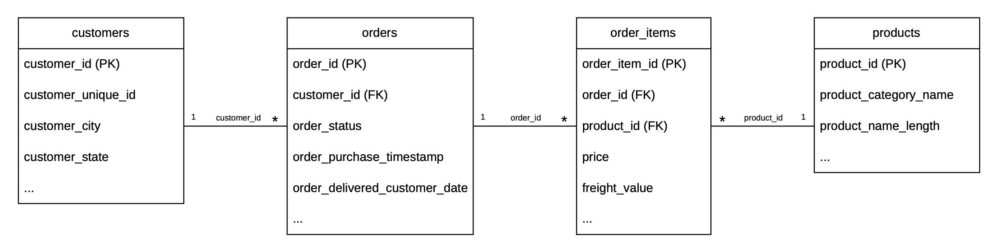

# E-commerce ETL Pipeline


## Overview

An end-to-end ETL project built with Python, SQL, and MySQL using the Brazilian E-Commerce Public Dataset by Olist.

The project implements a complete ETL pipeline that extracts, transforms, and loads raw e-commerce data into a MySQL relational database, enabling business reporting through SQL analytics.

This project was developed to simulate a real-world data engineering workflow, from raw transactional data to business-ready analytics.

---

## Objectives

* Build a production-style ETL pipeline.
* Transform raw e-commerce data into analytics-ready datasets.
* Load transformed data into MySQL.
* Answer business questions using SQL.

---

## Dataset

This project uses the Brazilian E-commerce Public Dataset by Olist.

**Source:**
https://www.kaggle.com/datasets/olistbr/brazilian-ecommerce

**Dataset size**

- Customers: 99,441
- Orders: 99,441
- Order Items: 112,650
- Products: 32,951

**Tables used:**

- Customers
- Orders
- Order Items
- Products

**Raw files are stored in:**

```text
data/raw/
```

**Transformed datasets are stored in:**

```text
data/clean/
```
---

## Technology Stack

* Python
* Pandas
* SQLAlchemy
* PyMySQL
* MySQL
* SQL
* Git
* GitHub
* Visual Studio Code

---

## Skills demonstrated

- ETL Pipeline
- Data Cleaning
- Feature Engineering
- Relational Database Design
- SQL Analytics
- Data Validation

---

## Architecture

<p align="left">
  
</p>

---

## ETL Workflow

```text
Raw CSV Files
      │
      ▼
Extract (Python)
      │
      ▼
Transform
- Remove duplicates
- Handle missing values
- Standardize data types
- Feature engineering
   • Revenue
   • Delivery days
      │
      ▼
Load (MySQL)
      │
      ▼
SQL Analytics
```

---

## Database Schema

The ETL pipeline loads transformed data into a MySQL relational database.



---

## Business Questions

The following analytical queries were designed to answer business questions for different stakeholders.

### 1. CEO — Business Overview

**Business Question**

- What is the overall business performance?

**Key Metrics**

- Total revenue
- Total orders
- Total customers
- Average order value

**Implementation**

`sql/analytics/business_overview.sql`

### 2. Sales Manager — Sales Performance

**Business Questions**

- How do sales and revenue change over time?
- Which customer states generate the highest revenue?

**Implementation**

- `sql/analytics/sales_trend.sql`
- `sql/analytics/regional_sales.sql`

### 3. Logistics Manager — Delivery Performance

**Business Questions**

- What is the average delivery time?
- Are there delayed deliveries?
- Which customer states have the highest average freight cost?

**Implementation**

- `sql/analytics/delivery_analysis.sql`
- `sql/analytics/freight_analysis.sql`

---

## Repository Structure

```
data/
    raw/
    clean/

python/
    extract/
        extract_data.py
    transform/
        transform_customers.py
        transform_orders.py
        transform_products.py
        transform_order_items.py
    load/
        load_to_mysql.py
    utils/
        config.py

sql/
    analytics/
    validation/
    schema.sql

docs/

README.md
```
---

## Installation

```bash
git clone https://github.com/tanitsorn/ecommerce-etl-pipeline.git
cd ecommerce-etl-pipeline

pip install -r requirements.txt

python -m python.main
```
---

## Usage

Run the ETL pipeline:

```bash
python -m python.main
```

The pipeline will:

- Extract raw CSV files
- Transform and clean the data
- Load transformed data into MySQL
- Prepare the database for analytical SQL queries

After loading, analytics queries can be executed from:

sql/analytics/

---

## Sample Output

### Business Overview

Example SQL query result after loading the data.

<p align="left">
   </p>

### ETL Pipeline

Example pipeline execution in the terminal.

<p align="left">
   </p>

---

## Analytics SQL

Analytics queries are available under:

`sql/analytics/`

- business_overview.sql
- sales_trend.sql
- delivery_analysis.sql
- product_analysis.sql
- regional_sales.sql

---

## Validation SQL

Validation queries are available under:

`sql/validation/`

- duplicate_check.sql
- null_check.sql
- sanity_check.sql

---

## Project Status

🟢 Completed

The ETL pipeline has been fully implemented and tested.

Features:
- Automated ETL pipeline
- Data transformation and cleaning
- Relational MySQL database
- SQL analytics queries
- Data validation queries

---

## Future Improvements

- Docker
- Apache Airflow
- Unit Tests
- GitHub Actions CI/CD

---

## Acknowledgements

This project uses the following resources:

- Brazilian E-Commerce Public Dataset by Olist
  https://www.kaggle.com/datasets/olistbr/brazilian-ecommerce

- Python
- Pandas
- SQLAlchemy
- MySQL